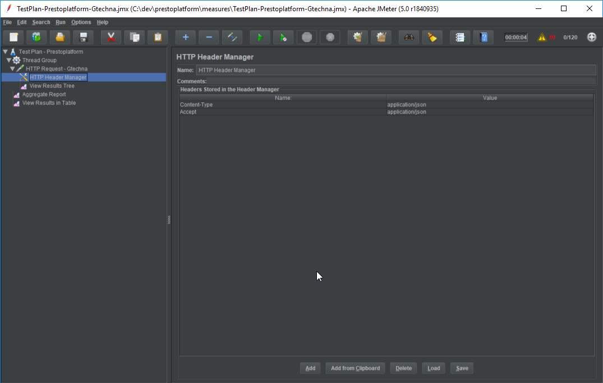
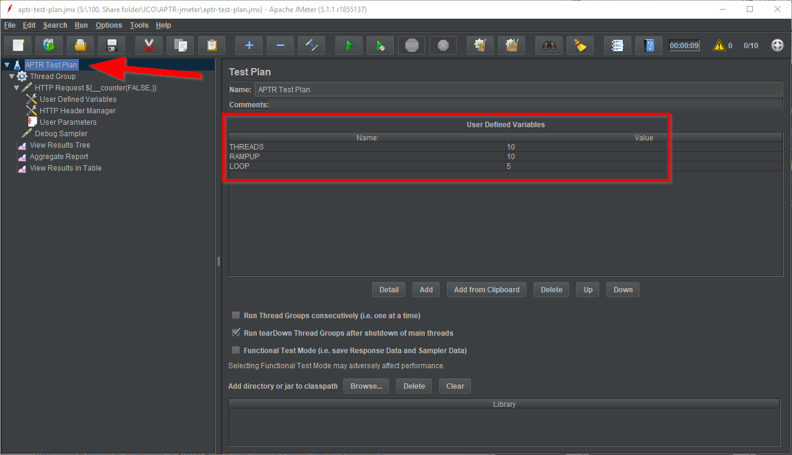
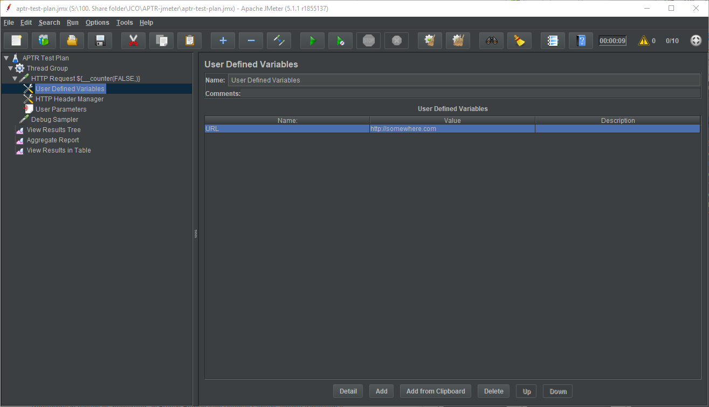
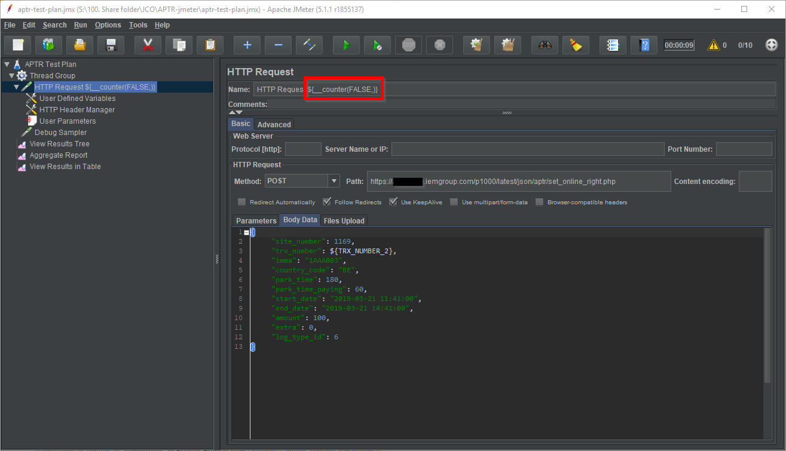
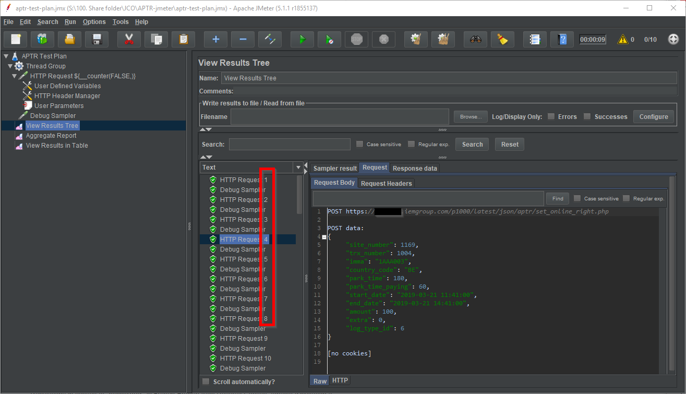
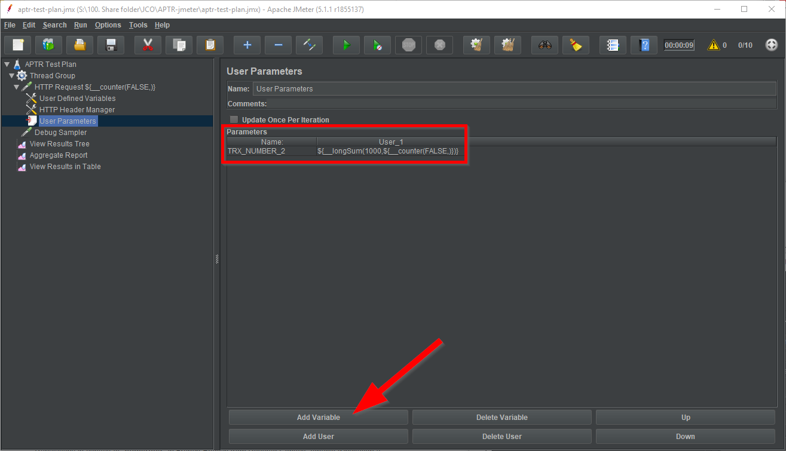
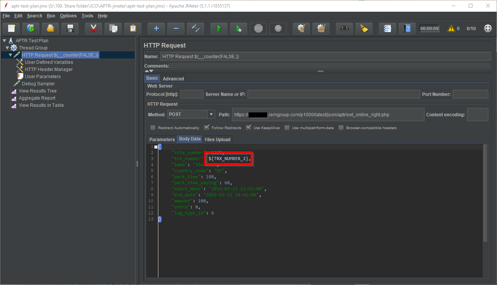

# JMeter

## Concepts

- A __Test Plan__ contains:
   - __User Defined Variables__ aka:
      - `THREADS`: count of sessions opened during a period
      - `RAMPUP`: the duration in seconds of this period (see [JMeter Ramp-Up - The Ultimate Guide | BlazeMeter](https://www.blazemeter.com/blog/jmeter-ramp-up-the-ultimate-guide) for more details)
      - `LOOP`: count of runs (total of threads = `THREADS` * `RAMPUP` * `LOOP`)
   - __Thread Group__ that defines:
      - Count of simultenous connections, by using _User Defined Variables_
      - _Samplers__ as __HTTP Request__ to test an URL
         - You can use slugs from files to customize URLS: `/${__StringFromFile(C://dev//spikes//jmeter//data//slugs.txt)}` in `Path` field. See [Apache JMeter - User's Manual: Functions and Variables](https://jmeter.apache.org/usermanual/functions.html#__StringFromFile)
   - __Listeners__ as __Aggregate Report__ and __View Results in Table__ to see results / measures
      - WARNING: define `Filename` before launching the campaign if you want to save data

To define JSON data to send by `POST`:

## Variables

There are different concepts:
- (built-in) functions
- variables
- properties

See official documentation on: 
- [Variables and properties](https://jmeter.apache.org/usermanual/test_plan.html#properties)
- [Functions and Variables](https://jmeter.apache.org/usermanual/functions.html#__counter)

And different scopes
- "[User Defined Variables](https://jmeter.apache.org/usermanual/component_reference.html#User_Defined_Variables)" are defined for each test and them remain constant
- "[User Parameters](https://jmeter.apache.org/usermanual/component_reference.html#User_Parameters)" are updated on each thread

### Scopes

First, variables can be defined for a whole Plan in the root "Test Plan" node, in the User Defined Variables section, as we did it for example for the variables `THREADS`, `RAMPUP` and `LOOP`.

Second, variables can be defined for each Thread Group by adding a "User Defined Variables" node (from Add > Config Element contextual menu): they are copied for each Thread, so they are the same for all Threads.

Third, variables can be defined for each Thread by adding a "User Parameters" node (from Add > Pre Processors contextual menu): see the sample "Define an ID" below

We will use a "simple" counter in different contexts to understand that.

There is several ways to use a counter:
- the powerfull built-in `__counter(...)` function do the job in a lot of situation
- the `Counter Config Element` (see the link below)
- a home made scripted counter: [How to Use a Counter in a JMeter Test | BlazeMeter](https://www.blazemeter.com/blog/how-use-counter-jmeter-test)

We will use the `__counter` function in all of our cases. The first parameter defines if the result is the same for all Users / Threads (`TRUE`) or different for each Thread (`FALSE`). As we want an index for the Threads (a different number), we will use `FALSE`. The second optional parameter is the name of a variable to store the result.

### Display the variables

Add a "View Results Tree" node (from Add > Listeners contextual menu) to see variables content

### Number the threads

1. Modify the default "HTTP Request" Name by adding at the end `${__counter(FALSE,)}`
2. ... That's all folks!

You can see the result in the "View Results Tree".

### Define an ID

For example we want to create an ID by using the Thread counter with a default starting number:

1. Add a "User Parameters" node (from Add > Pre Processors contextual menu)
1. Add Variable for example `TRX_NUMBER` with the value `${__longSum(1000,${__counter(FALSE,)})}` (sum the long values 1000 and the current thread index)
1. You can then use this new created variable in the request definition as `${TRX_NUMBER}`

## Resources

- [Apache JMeter - User's Manual: Getting Started](https://jmeter.apache.org/usermanual/get-started.html)
- [Mazira - Introduction to Load Balancing Using Node.js - Part 1](https://mazira.com/blog/introduction-load-balancing-nodejs)
- [Load Testing with JMeter: Part 1 - Getting Started | Lincoln Loop](https://lincolnloop.com/blog/2011/sep/21/load-testing-jmeter-part-1-getting-started/)
