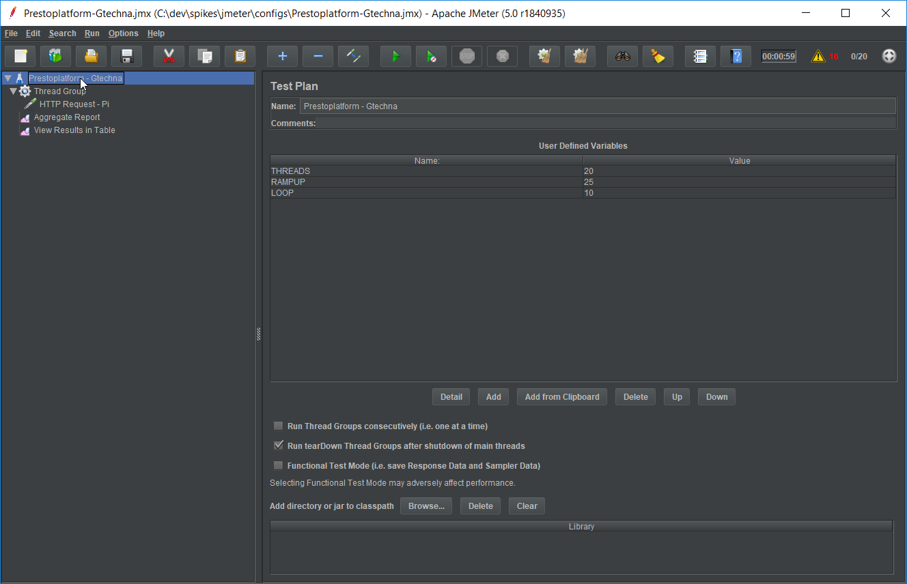
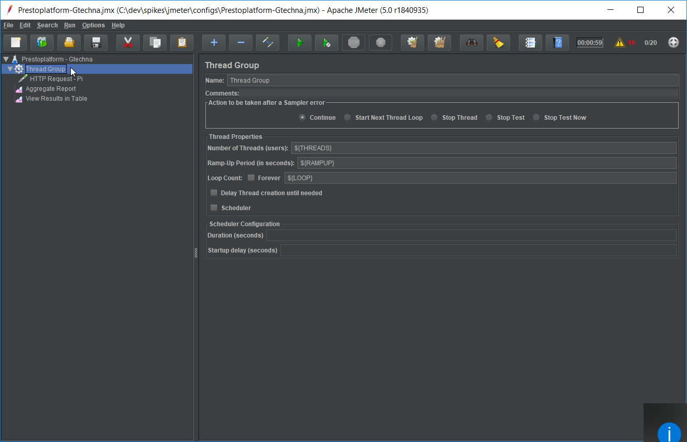
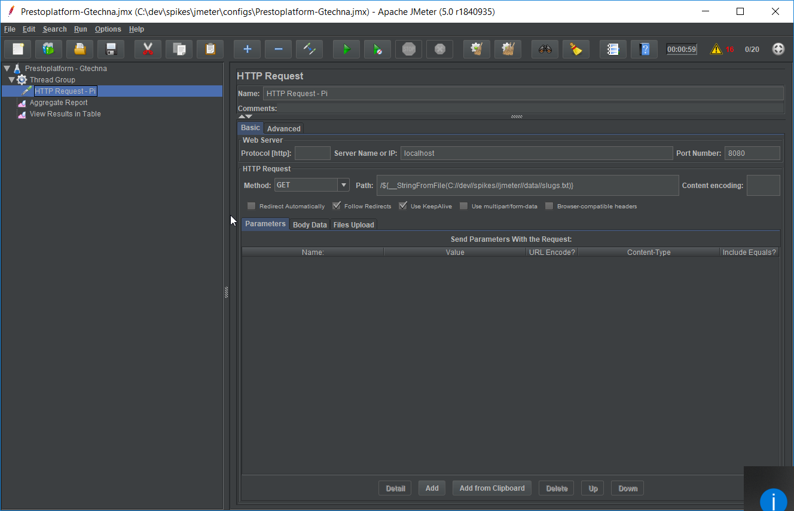
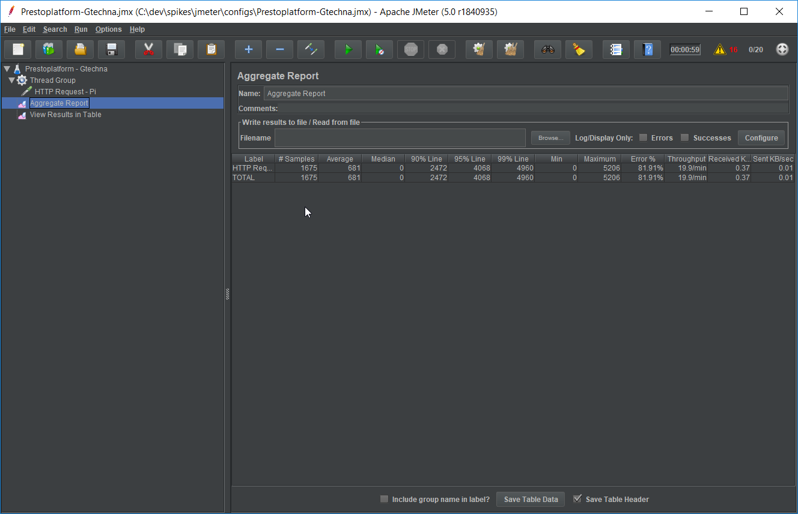
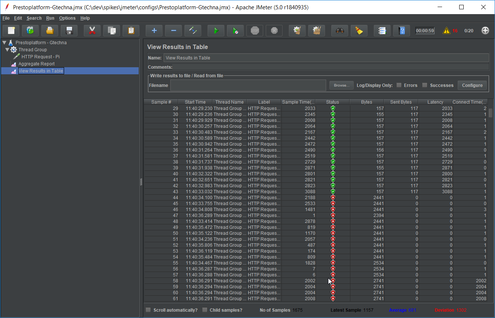

# JMeter

## Concepts

- A __Test Plan__ contains:
   - __User Defined Variables__ aka:
      - `THREADS`: count of sessions opened during a period
      - `RAMPUP`: the duration in seconds of this period (see [JMeter Ramp-Up - The Ultimate Guide | BlazeMeter](https://www.blazemeter.com/blog/jmeter-ramp-up-the-ultimate-guide) for more details)
      - `LOOP`: count of runs (total of threads = `THREADS` * `RAMPUP` * `LOOP`)
   - __Thread Group__ that defines:
      - Count of simultenous connections, by using _User Defined Variables_
      - _Samplers__ as __HTTP Request__ to test an URL
         - You can use slugs from files to customize URLS: `/${__StringFromFile(C://dev//spikes//jmeter//data//slugs.txt)}` in `Path` field. See [Apache JMeter - User's Manual: Functions and Variables](https://jmeter.apache.org/usermanual/functions.html#__StringFromFile)
   - __Listeners__ as __Aggregate Report__ and __View Results in Table__ to see results / measures
      - WARNING: define `Filename` before launching the campaign if you want to save data

To define JSON data to send by `POST`:

## Resources

- [Apache JMeter - User's Manual: Getting Started](https://jmeter.apache.org/usermanual/get-started.html)
- [Mazira - Introduction to Load Balancing Using Node.js - Part 1](https://mazira.com/blog/introduction-load-balancing-nodejs)
- [Load Testing with JMeter: Part 1 - Getting Started | Lincoln Loop](https://lincolnloop.com/blog/2011/sep/21/load-testing-jmeter-part-1-getting-started/)
